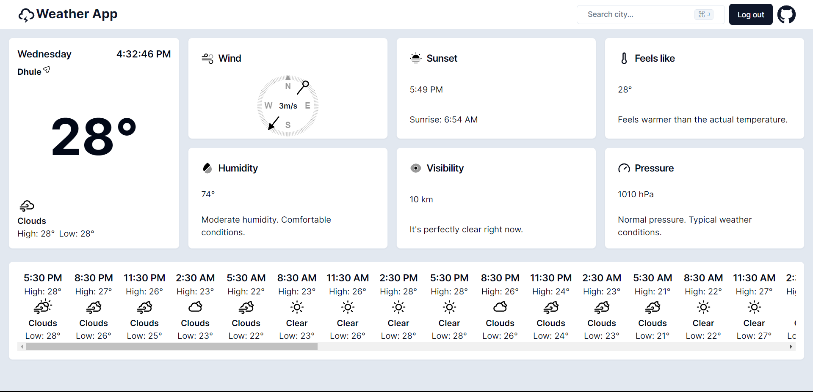

# Weather-App

Get daily weather updates with protected authentication.



## Getting Started

Follow these instructions to set up the project on your local machine for development and testing purposes.

### Prerequisites

Make sure you have the following software installed on your system:

- [Yarn](https://yarnpkg.com/)

### Installation

1. Clone the repository:

    ```bash
    git clone https://github.com/lohargaurav00/weather-app
    ```

2. Install the necessary packages:

    ```bash
    yarn install
    ```

3. Configure Environment Variables

   - Rename the `.env.example` file to `.env` and add your MongoDB connection URL to the `.env` file.

4. Start the Development Server:

    ```bash
    yarn dev
    ```

    Note: The development server will start on port `3000`.
        
## Scripts 

- Start development server: `yarn dev`
- Run dry server: `yarn start`
- For production build: `yarn build`
- Start build server: `yarn serve`

## Built With

- [Next.js](https://nextjs.org/)
- [MongoDB](https://www.mongodb.com/)
- [NextAuth](https://next-auth.js.org/)
- [OpenWeatherMap API](https://openweathermap.org/api)

## Live API

The API is hosted at [https://weather-app-lohargaurav00.vercel.app/](https://weather-app-lohargaurav00.vercel.app/)

## Authors

- Gaurav D. Lohar